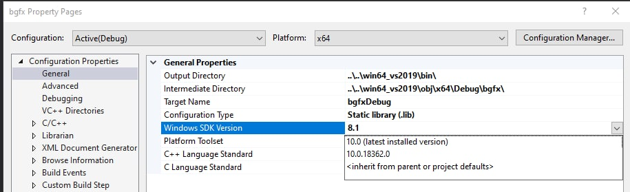
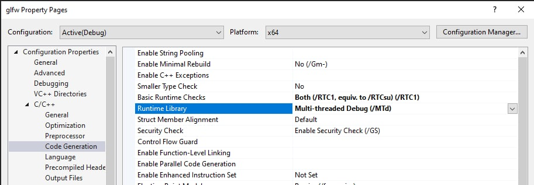

# How build with Visual Studio
1. Clone 3rdParty submodules
```
git submodule init
git submodule update
```
2. build bgfx
```
cd 3rdParty/bgfx/
..\bx\tools\bin\windows\genie --with-examples vs2019
```
3. build glfw
```
cd ../glfw/
cmake .
```
4. In properties for projects change windows SDK from 8.1 to 10 or smth like this (Projects: bgfx, bimg, bx, example-common)

5. For glfw project set Multi-threaded Debug (/MTd)
